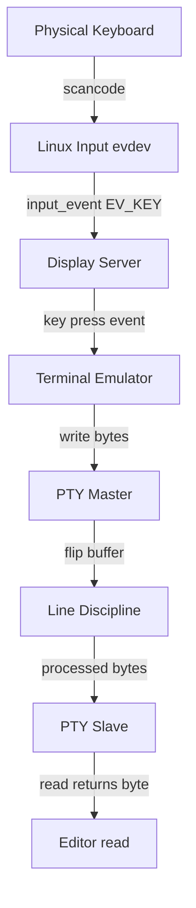

# Input Path — from key to read()

```mermaid
graph TD
    KB[Physical Keyboard] -->|scancode| EV[Linux Input evdev]
    EV -->|input_event EV_KEY| DS[Display Server]
    DS -->|key press event| TE[Terminal Emulator]
    TE -->|write bytes| PM[PTY Master]
    PM -->|flip buffer| LD[Line Discipline]
    LD -->|processed bytes| PS[PTY Slave]
    PS -->|read returns byte| ED[Editor read]
```
