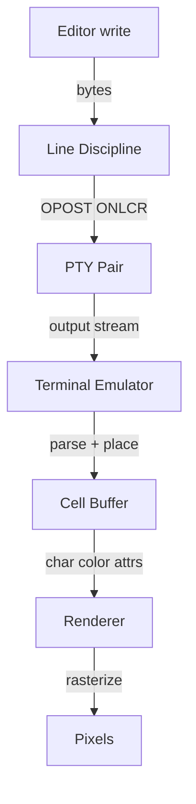

# Output Path — from write() to pixels

```mermaid
graph TD
    ED[Editor write] -->|bytes| LD[Line Discipline]
    LD -->|OPOST ONLCR| PM[PTY Pair]
    PM -->|output stream| TE[Terminal Emulator]
    TE -->|parse + place| CB[Cell Buffer]
    CB -->|char color attrs| RN[Renderer]
    RN -->|rasterize| PX[Pixels]
```
