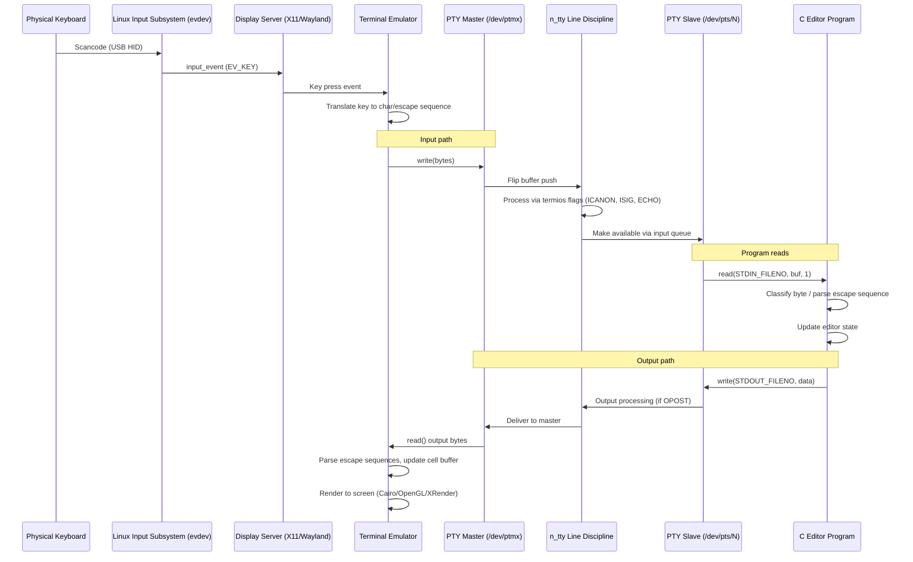

# Keyboard Input to Display Flow

## Overview

This document traces the full path of a keypress from physical keyboard to on-screen display in a Linux terminal environment: keyboard hardware → kernel input subsystem → terminal emulator → PTY → line discipline → C program stdin → C program stdout → PTY → terminal emulator display.

---

## 1. Physical Keyboard → Kernel

### 1.1 Key Press → Scancode

When a key is pressed on a physical keyboard:

1. The keyboard matrix detects the key closure.
2. The keyboard controller (or MCU in USB keyboards) generates a **scancode** — a numeric code identifying the physical key position (not the character).
3. For USB HID keyboards, scancodes follow the USB HID Usage Tables (see [USB-IF HID Usage Tables](https://www.usb.org/hid)).
4. The scancode is sent to the host via USB interrupt transfer.

Reference: [Linux kernel input documentation](https://www.kernel.org/doc/html/latest/input/input.html), [USB HID spec](https://www.usb.org/hid)

### 1.2 Kernel Input Subsystem (evdev)

The Linux kernel input subsystem processes scancodes:

1. **USB HID driver** receives the raw scancode from the USB controller.
2. The **HID layer** (drivers/hid/) maps USB HID usages to Linux key codes (`KEY_*` constants in `include/uapi/linux/input-event-codes.h`).
3. The input core creates an `struct input_event` containing:
   - `type`: `EV_KEY` for key events
   - `code`: the Linux key code (e.g., `KEY_A` = 30)
   - `value`: 1 (press), 0 (release), 2 (auto-repeat)
4. The event is delivered to **evdev** (`drivers/input/evdev.c`), which makes it available via `/dev/input/event*` character devices.

Reference: `man 4 input`, `Documentation/input/input.rst` in kernel tree, [evdev protocol](https://www.kernel.org/doc/html/latest/input/input.html)

### 1.3 Input Routing: evdev to TTY

There are two paths from kernel input to the terminal:

- **Direct TTY path (console):** For virtual consoles (/dev/ttyN), the keyboard events are processed by the **vt** (virtual terminal) layer and written to the console TTY's input queue.
- **evdev path (GUI terminal):** For GUI terminal emulators, the X11/Wayland display server reads events from `/dev/input/event*` (via libinput or XInput), processes them, and forwards characters/sequences to the focused terminal emulator window.

Reference: `man 4 console`, `man 7 libinput`

---

## 2. Terminal Emulator → TTY

### 2.1 How Terminal Emulators Input

A GUI terminal emulator (GNOME Terminal, Konsole, xterm):

1. Receives key press events from the display server (X11/Wayland).
2. Translates the key + modifier state into characters or escape sequences:
   - Printable keys → corresponding ASCII/UTF-8 bytes
   - Control+letter → control codes (0x00–0x1F)
   - Arrow keys, function keys → ECMA-48 control sequences
3. Writes the bytes to the **master end** of a **pseudoterminal (PTY)**.

### 2.2 Pseudoterminal Pair

A PTY is a pair of virtual devices:
- **Master** (`/dev/ptmx`): opened by the terminal emulator
- **Slave** (`/dev/pts/N`): opened by the foreground process (shell, editor)

Data flow:
- Terminal emulator writes to master → kernel delivers to slave's input queue via TTY discipline.
- Process writes to slave → kernel delivers to master → terminal emulator reads and renders.

Reference: `man 7 pty`, `man 4 pts`

---

## 3. Line Discipline Role

### 3.1 n_tty Line Discipline

The **line discipline** is a kernel layer between the TTY device and the user-space process. Linux default is **N_TTY** (the `n_tty` line discipline, `drivers/tty/n_tty.c`). It sits between the PTY master/slave pair and the file operations that user-space calls.

### 3.2 Cooked (Canonical) Mode

When the terminal is in **cooked (canonical) mode** (`ICANON` flag set in `termios.c_lflag`):

- **Line buffering:** Input is buffered until a line delimiter (NL, EOL, EOF) is received.
- **Line editing:** The ERASE (backspace), KILL (Ctrl-U), WERASE (Ctrl-W) characters work automatically.
- **Echo:** Input characters are automatically echoed back to the output (TTY → PTY master → terminal emulator).
- **Signal generation:** Special characters trigger signals:
  - `Ctrl-C` (VINTR=0x03): sends `SIGINT` to the foreground process group.
  - `Ctrl-Z` (VSUSP=0x1A): sends `SIGTSTP`.
  - `Ctrl-\` (VQUIT=0x1C): sends `SIGQUIT`.
- The `ECHO` flag controls whether input is automatically echoed.
- The `ECHOCTL` flag causes control characters to be echoed as `^X`.

### 3.3 Raw (Noncanonical) Mode

When `ICANON` is cleared (raw mode), used by editors like `kilo`:

- No line buffering — bytes are available immediately.
- No automatic echo.
- No automatic line editing.
- No signal generation (if `ISIG` is also cleared).
- All bytes are passed through as-is to the reading process.

**cfmakeraw()** sets a comprehensive raw mode (see `man 3 termios`):

```c
termios_p->c_iflag &= ~(IGNBRK | BRKINT | PARMRK | ISTRIP
                | INLCR | IGNCR | ICRNL | IXON);
termios_p->c_oflag &= ~OPOST;
termios_p->c_lflag &= ~(ECHO | ECHONL | ICANON | ISIG | IEXTEN);
termios_p->c_cflag &= ~(CSIZE | PARENB);
termios_p->c_cflag |= CS8;
```

### 3.4 tcsetattr() and tcgetattr()

- **tcgetattr()** reads the current terminal attributes from the kernel.
- **tcsetattr()** modifies them. The `TCSANOW`, `TCSADRAIN`, `TCSAFLUSH` constants control when the change takes effect.

Reference: `man 3 termios`, `man 3 tcsetattr`, `man 4 tty`

---

## 4. C Program Read Path

### 4.1 The `read()` System Call

When a C program calls `read(STDIN_FILENO, buf, 1)`:

1. **System call entry:** `sys_read()` in the kernel (fs/read_write.c).
2. **VFS layer:** Routes to the TTY driver's `read` operation.
3. **TTY layer (drivers/tty/tty_io.c):** Locks the TTY, calls the line discipline's `read` method.
4. **n_tty_read() (drivers/tty/n_tty.c):** 
   - If no data is available, the process is put to sleep on a **wait queue** (`tty->read_wait`).
   - The process remains blocked until data arrives or a signal interrupts.
5. **Data arrival:**
   - Terminal emulator writes bytes to PTY master.
   - PTY master interrupt handler calls `tty_flip_buffer_push()`.
   - This wakes the waiting process via the wait queue mechanism.
6. **Data copy:** Data is copied from the kernel's flip buffer to user-space buffer. The `read()` returns the number of bytes read (1 in this case).

### 4.2 Blocking vs Non-blocking

- **Blocking** (default): `read()` blocks until data is available.
- **Non-blocking** (`O_NONBLOCK` on the fd, or `VTIME=0, VMIN=0`): `read()` returns 0 immediately if no data.
- **VMIN/VTIME** behavior (see `man 3 termios`):
  - `VMIN=0, TIME=0`: Polling read — returns immediately with available data or 0.
  - `VMIN=1, TIME=0`: Blocking — waits until at least 1 byte is available.
  - `VMIN=0, TIME>0`: Read with timeout — waits at most TIME deciseconds.
  - `VMIN>0, TIME>0`: Inter-byte timer — returns after VMIN bytes or TIME deciseconds between bytes.

Reference: `man 2 read`, `man 3 termios` (VMIN/VTIME section), kernel source `drivers/tty/n_tty.c`

---

## 5. Key Classification

A terminal editor must classify each incoming byte:

### 5.1 Printable ASCII (0x20–0x7E)

Standard printable characters: letters, digits, punctuation, space. Written directly to the buffer.

### 5.2 Control Characters (0x00–0x1F)

Ctrl-letter combinations produce codes 0x00–0x1F:
- `Ctrl-A` = 0x01, `Ctrl-B` = 0x02, ..., `Ctrl-Z` = 0x1A
- `Ctrl-[` = 0x1B (ESC), `Ctrl-\` = 0x1C, `Ctrl-]` = 0x1D, `Ctrl-^` = 0x1E, `Ctrl-_` = 0x1F
- `Ctrl-@` (or null) = 0x00
- `Ctrl-?` (or Ctrl-Backspace) = 0x7F (DEL)

Reference: [ASCII table](https://man7.org/linux/man-pages/man7/ascii.7.html)

### 5.3 Escape Sequences (Starting with 0x1B)

When the editor reads 0x1B (ESC), it may be:
- ESC key alone (0x1B)
- Start of a multi-byte control sequence (CSI/SS3 sequences)

Most modern terminals use **CSI (Control Sequence Introducer)** sequences: `ESC [ ... `.

Common CSI sequences:

| Key | Sequence | Bytes (hex) |
|-----|----------|-------------|
| Up arrow | CSI A | 1B 5B 41 |
| Down arrow | CSI B | 1B 5B 42 |
| Right arrow | CSI C | 1B 5B 43 |
| Left arrow | CSI D | 1B 5B 44 |
| Page Up | CSI 5~ | 1B 5B 35 7E |
| Page Down | CSI 6~ | 1B 5B 36 7E |
| Home | CSI H or CSI 1~ | 1B 5B 48 or 1B 5B 31 7E |
| End | CSI F or CSI 4~ | 1B 5B 46 or 1B 5B 34 7E |
| Delete | CSI 3~ | 1B 5B 33 7E |
| Insert | CSI 2~ | 1B 5B 32 7E |
| F1 | SS3 P | 1B 4F 50 |
| F2 | SS3 Q | 1B 4F 51 |
| F3 | SS3 R | 1B 4F 52 |
| F4 | SS3 S | 1B 4F 53 |

Some terminals also send **SS3 (Single Shift Select of G3, `ESC O`)** sequences for F-keys and the application keypad.

Reference: `man 4 console_codes`, [XTerm Control Sequences](https://invisible-island.net/xterm/ctlseqs/ctlseqs.html), [ECMA-48](https://www.ecma-international.org/publications-and-standards/standards/ecma-48/)

### 5.4 Decoding Multi-byte Escape Sequences

A single-byte `read(STDIN_FILENO, buf, 1)` loop requires the editor to:
1. Read the first byte. If it's `0x1B` (ESC), enter escape sequence parsing mode.
2. Read the next byte. If it's `[` (0x5B), we have a CSI sequence. If it's `O` (0x4F), we have an SS3 sequence. Otherwise it might be just ESC.
3. Continue reading bytes:
   - Parameter bytes: `0x30–0x3F` (digits, `;`, `<`, `=`, `>`, `?`)
   - Intermediate bytes: `0x20–0x2F` (space through `/`)
   - Final byte: `0x40–0x7E` (terminates the sequence)
4. Once the final byte is matched, dispatch the recognized sequence.

Reference: ECMA-48 section 5.4, [VT100.net](https://vt100.net/docs/vt100-ug/chapter3.html)

---

## 6. Output Path

### 6.1 `write(STDOUT_FILENO, ...)` to Terminal Emulator

1. **System call:** `sys_write()` in the kernel.
2. **VFS:** Routes to the TTY driver (slave end of PTY).
3. **Line discipline output processing:** If `OPOST` is set in `c_oflag`, output processing occurs (e.g., mapping NL to CR-NL via `ONLCR`). In raw mode, `OPOST` is cleared, so bytes pass through unmodified.
4. **PTY master:** The output reaches the PTY master, where the terminal emulator reads it via `read()`.
5. **Terminal emulator rendering:**
   - The emulator parses escape sequences in the output stream.
   - Printable characters are rendered using the configured font.
   - Control sequences (cursor movement, colors, clear screen) update the cell buffer.
   - The display is updated (e.g., via XRender, Cairo, or OpenGL).

### 6.2 Terminal Emulator Display Rendering

The terminal emulator maintains a **cell buffer** — a 2D grid of character cells, each with foreground color, background color, and attributes (bold, italic, underline, etc.). 

- `write()` data is appended to the emulator's input buffer.
- For each byte, the emulator determines if it is part of an escape sequence or literal text.
- Literal characters are placed into the cell buffer at the cursor position.
- Control sequences (from `write()` or embedded in the output) update the cursor position, colors, or screen state.

Reference: [GNOME Terminal/VTE](https://gitlab.gnome.org/GNOME/vte), [xterm source](https://invisible-island.net/xterm/), `man 4 console_codes`

---

## 7. Flow Diagram (Mermaid)



---

## 8. ASCII Art Flow Diagram

```
┌──────────────────┐     press key      ┌─────────────────────┐
│  Physical Keyboard │ ──────────────────>│  USB HID Driver     │
└──────────────────┘                     │  (kernel/scancode)  │
                                          └─────────┬───────────┘
                                                    │ input_event
                                                    ▼
                                          ┌─────────────────────┐
                                          │  evdev (/dev/input) │
                                          └─────────┬───────────┘
                                                    │ libinput / XInput
                                                    ▼
                                          ┌─────────────────────┐
                                          │  Display Server     │
                                          │  (X11/Wayland)      │
                                          └─────────┬───────────┘
                                                    │ key press event
                                                    ▼
  ┌───────────────────────────────────────────────────────────────────────┐
  │                     TERMINAL EMULATOR                                 │
  │                                                                       │
  │  Key press → Translate to character/escape sequence                  │
  │  write() to PTY master                                                │
  └──────────────────────────────────┬────────────────────────────────────┘
                                     │
                                     ▼
                    ┌────────────────────────────────┐
                    │  PTY Master (/dev/ptmx)         │
                    │  flip_buffer_push()             │
                    └──────────────┬─────────────────┘
                                   │
                                   ▼
                    ┌────────────────────────────────┐
                    │  n_tty Line Discipline          │
                    │  ┌─────────────────────────┐   │
                    │  │ ICANON: line buffering  │   │
                    │  │ ISIG:  signal generation│   │
                    │  │ ECHO:  echo input       │   │
                    │  │ IEXTEN: extra processing│   │
                    │  └─────────────────────────┘   │
                    │  VMIN/VTIME control read()     │
                    └──────────────┬─────────────────┘
                                   │
                                   ▼
                    ┌────────────────────────────────┐
                    │  PTY Slave (/dev/pts/N)        │
                    │  input queue                   │
                    └──────────────┬─────────────────┘
                                   │
                                   ▼
                    ┌────────────────────────────────┐
                    │  C Editor Program               │
                    │                                 │
                    │  read(STDIN_FILENO, buf, 1)    │
                    │     → sys_read()                │
                    │     → block on wait queue       │
                    │     → data available            │
                    │     → copy to userspace         │
                    │                                 │
                    │  Input dispatch:                │
                    │  ┌─────────────────────────┐   │
                    │  │ Printable? → buffer     │   │
                    │  │ Ctrl-char? → action    │   │
                    │  │ ESC? → parse seq       │   │
                    │  │ Unknown? → ignore/beep │   │
                    │  └─────────────────────────┘   │
                    │                                 │
                    │  write(STDOUT_FILENO, data)    │
                    │     → sys_write()               │
                    └──────────────┬─────────────────┘
                                   │
                                   ▼
                    ┌────────────────────────────────┐
                    │  PTY Slave → n_tty             │
                    │  (OPOST processing if enabled) │
                    └──────────────┬─────────────────┘
                                   │
                                   ▼
                    ┌────────────────────────────────┐
                    │  PTY Master                    │
                    │  read() → terminal emulator    │
                    └──────────────┬─────────────────┘
                                   │
                                   ▼
  ┌───────────────────────────────────────────────────────────────────────┐
  │                     TERMINAL EMULATOR                                 │
  │                                                                       │
  │  Parse escape sequences in output stream                             │
  │  Update cell buffer (char, color, attrs)                             │
  │  Render display (font rasterization, GL/Cairo/XRender)              │
  └───────────────────────────────────────────────────────────────────────┘
```

---

## 9. Summary of Key System Calls and Functions

| Component | Function | Description |
|-----------|----------|-------------|
| Input subsystem | `/dev/input/event*` | evdev character device |
| X11/Wayland | `XNextEvent` / `wl_keyboard_listener` | Input event delivery |
| Terminal emulator | `write(pfd, buf, n)` | Write to PTY master |
| Kernel TTY | `tty_write`, `n_tty_write` | TTY output path |
| Line discipline | `n_tty_read`, `n_tty_write` | Input/output processing |
| Kernel TTY flip buffer | `tty_flip_buffer_push` | Data availability notification |
| Process | `read(STDIN_FILENO, buf, 1)` | Single-byte read |
| Process | `write(STDOUT_FILENO, buf, n)` | Output to terminal |

---

## Bibliography

1. **[Linux Kernel Input Documentation](https://www.kernel.org/doc/html/latest/input/input.html)** — Overview of the Linux input subsystem.
2. **[evdev Protocol](https://www.kernel.org/doc/html/latest/input/input.html)** — The evdev interface for input events.
3. **[USB HID Usage Tables](https://www.usb.org/hid)** — USB HID scancode definitions.
4. **[man 4 input](https://man7.org/linux/man-pages/man4/input.4.html)** — Linux input device documentation.
5. **[man 4 console](https://man7.org/linux/man-pages/man4/console.4.html)** — Console terminal interface.
6. **[man 4 console_codes](https://man7.org/linux/man-pages/man4/console_codes.4.html)** — Linux console escape sequences.
7. **[man 7 pty](https://man7.org/linux/man-pages/man7/pty.7.html)** — Pseudoterminal interfaces.
8. **[man 4 pts](https://man7.org/linux/man-pages/man4/pts.4.html)** — PTY slave device.
9. **[man 3 termios](https://man7.org/linux/man-pages/man3/termios.3.html)** — Terminal I/O interfaces (cfmakeraw, tcsetattr, VMIN/VTIME).
10. **[man 2 read](https://man7.org/linux/man-pages/man2/read.2.html)** — read() system call.
11. **[man 2 write](https://man7.org/linux/man-pages/man2/write.2.html)** — write() system call.
12. **[man 7 ascii](https://man7.org/linux/man-pages/man7/ascii.7.html)** — ASCII table with control character mappings.
13. **[XTerm Control Sequences](https://invisible-island.net/xterm/ctlseqs/ctlseqs.html)** — Comprehensive reference for terminal control sequences.
14. **[ECMA-48](https://www.ecma-international.org/publications-and-standards/standards/ecma-48/)** — Control Functions for Coded Character Sets.
15. **[VT100 User Guide](https://vt100.net/docs/vt100-ug/chapter3.html)** — Original VT100 terminal documentation.
16. **[Linux kernel n_tty.c](https://github.com/torvalds/linux/blob/master/drivers/tty/n_tty.c)** — Source of the N_TTY line discipline.
17. **[GNOME VTE](https://gitlab.gnome.org/GNOME/vte)** — Terminal widget library used by GNOME Terminal.
18. **[libinput Documentation](https://wayland.freedesktop.org/libinput/doc/latest/)** — Input device handling library.
